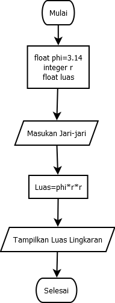

# latihan.py
## membuat program lingkaran 
### ini bentuk flowchart dari program menghitung luas dan keliling lingkaran

### menggunakan fungsi math
dengan kode math.pi dengan nilai 3.14

### ini adalah hasil dari luas dan keliling lingkaran
